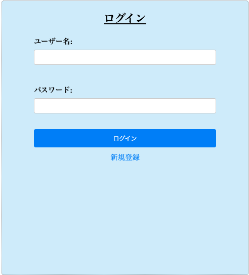
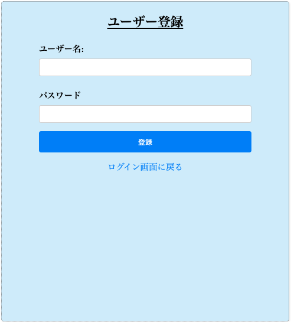
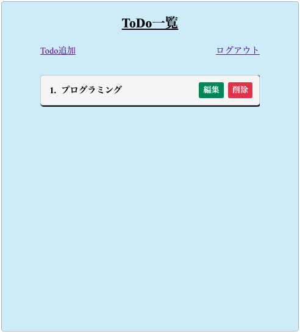
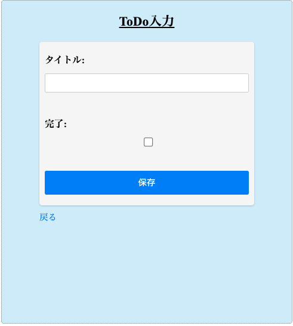

# Spring Boot ToDoアプリ(MySQL)

このアプリは、Java と Spring Bootを使って開発したTodoリスト管理アプリです。MySQLデータベースを使用しています。<br>
就活用ポートフォリオとして作成しました。

---
## 使用技術

- Java 17
- Spring Boot 3.x
- Spring Security
- Spring MVC / Thymeleaf
- Spring Data JPA
- MySQL
- Maven

---
## 主な機能

- ユーザー登録/ログイン/ログアウト
- タスクの一覧表示
- タスクの追加/編集/削除
- タスクの完了チェック機能
- ユーザーごとにToDoを管理

---
## ディレクトリ構成

```
src/
┝━━━━━main/
│ ┝━━━java/com/example/todo/
│ │┝━━━controller/
│ │┝━━━entity/
│ │┝━━━repository/
│ │┝━━━service/
| |└━━━TodoApplication.java
| └━━━resources/
|┝━━static/
|┝━━━templates/
|└━━━application.properties

```

---
## ローカルでの実行方法(MySQL使用)

# Spring Boot 実行

./mvnw spring-boot:run

---
## スクリーンショット

### ログイン画面


### 登録画面


### ToDoリスト画面


### Todo登録画面


---